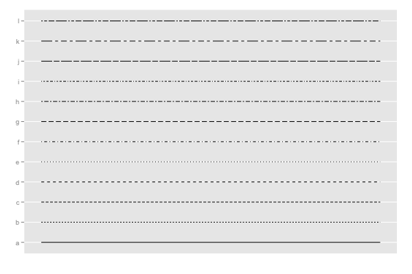
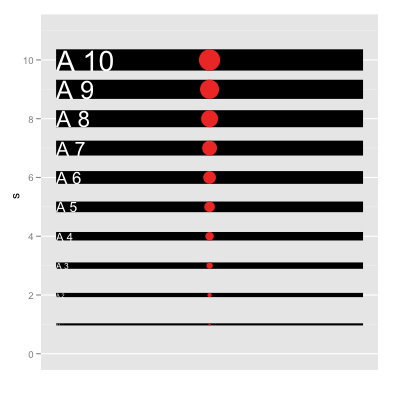
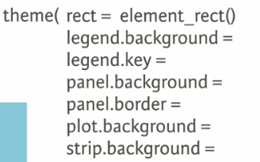
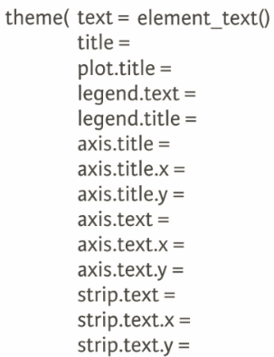
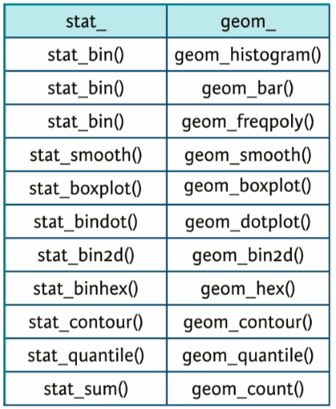
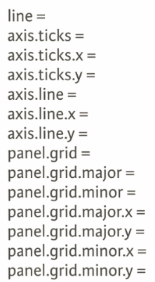
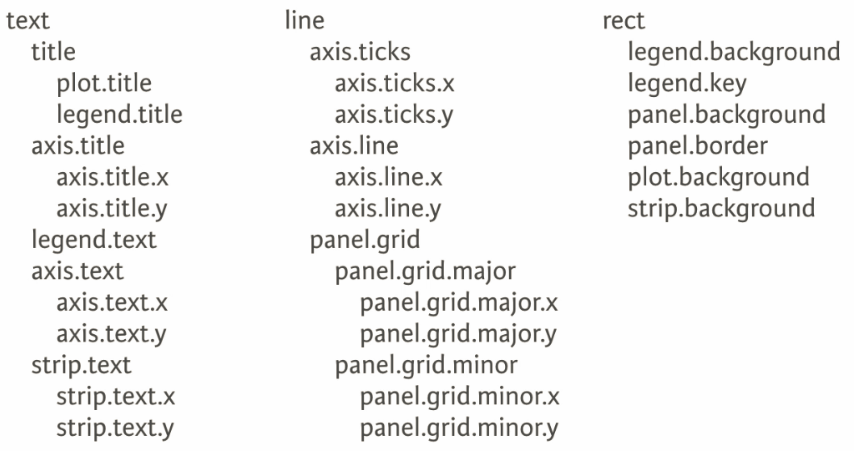
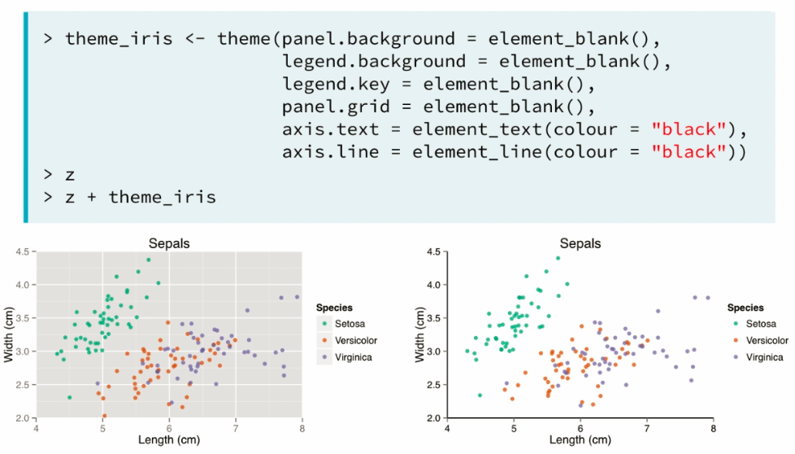

## _ggplot2_

---

### Grammar of Graphics

* Data & Aesthetics & Geometries & Facets & Statistics & Coordinates & Themes

### Data
```{r, warning=FALSE, message=FALSE}
#setwd("/home/creatrol/ws/R/Tutorials")
library(ggplot2)
library(dplyr)
library(tidyr)
```

#### factors 
```{r, fig.height=3, fig.width=4}
head(mtcars)
ggplot(mtcars, aes(x = cyl, y = mpg)) + 
  geom_point()          # considered as numeric
ggplot(mtcars, aes(x = factor(cyl), y = mpg)) + 
  geom_point()          # considered as factor
```

---

#### Point color & size & shape
```{r, fig.height=3, fig.width=4}
# class(mtcars$disp)   is numeric
# color
ggplot(mtcars, aes(x = wt, y = mpg, col = disp)) + 
  geom_point()
# size
ggplot(mtcars, aes(x = wt, y = mpg, size = disp))+
  geom_point()
# shape           -- can not be used to continuous variable
ggplot(mtcars, aes(x = wt, y = mpg, shape = factor(cyl))) +
  geom_point()
```

---

#### Point multiple variables

* not a good way

```{r, fig.height=4, fig.width=5}
head(iris)
ggplot(iris, aes(x = Sepal.Length, y = Sepal.Width)) +
  geom_point()+
  geom_point(aes(x = Petal.Length, y = Petal.Width), col = "red")
```

* the right way is to tidy data and use "col = "

#### Point Plots with groups  (facet_grid)

* consider about the relation between 4 variables

```{r, fig.height=3, fig.width=4}
# tidy data:
iris.tidy <- gather(iris, Part.Measure, Value, -Species)
iris.tidy2 <- separate(iris.tidy, Part.Measure, c("Part", "Measure"), sep = "\\.")
#iris.tidy2 <- iris.tidy %>% mutate(Part.Measure = gsub(pattern = "\\.", replacement = "_", x = Part.Measure)) %>% 
#  separate(Part.Measure, into = c("Part", "Measure"), sep= "_")
iris.tidy2$row <- 1:nrow(iris.tidy2)
iris.tidy <- spread(iris.tidy2, Species, Value)
iris.tidy2 <- iris.tidy2[,1:4]
# plot -- a hard way
str(iris.tidy)
ggplot(iris.tidy, aes(x = Part, y = setosa, col = Measure)) +
  geom_jitter()
ggplot(iris.tidy, aes(x = Part, y = versicolor, col = Measure)) +
  geom_jitter()
ggplot(iris.tidy, aes(x = Part, y = virginica, col = Measure)) +
  geom_jitter()
```
```{r, fig.height=3, fig.width=9}
# plot -- a easy way
str(iris.tidy2)
ggplot(iris.tidy2, aes(x = Part, y = Value, col = Measure)) +
  geom_jitter() + 
  facet_grid(. ~ Species)
```

---

### Aesthetics

Aesthetic | Description
--------- | ------------
x         | X axis position
y         | Y axis position
colour    | Colour of dots, outlines of other shapes
fill      | Fill color
size      | Diameter of points, thickness of lines
alpha     | Transparency
linetype  | Line dash pattern
labels    | Text on a plot or axes
shape     | Shape of points


* _Shape_


Empty inside can be "fill"

---

* _linetype_




---

* _size_



---

* _ggplot2-colour_


---

* _ggplot2-palette_


used for scale\_color\_brewer & scale\_fill\_brewer & scale\_colour\_distiller & scale\_fill\_distiller (palette = "")

---

#### Modifying Aesthetics

* Positions : 

      + identity(default), dodge, stack, fill, jitter, jitterdodge

_sample_ : jitter
```{r, fig.height=3, fig.width=4}
posn.j <- position_jitter(width = 0.1)  # add random noise to raw points
ggplot(iris, aes(x = Sepal.Length, y = Sepal.Width, col = Species)) +
  geom_point(position = posn.j)
```

_sample_ : stack & fill & dodge
```{r, fig.height=3, fig.width=4}
cyl.am <- ggplot(mtcars, aes(x = factor(cyl), fill = factor(am)))
cyl.am + geom_bar()
cyl.am + geom_bar(position = "stack")
cyl.am + geom_bar(position = "fill")
cyl.am + geom_bar(position = "dodge")
```

---

* Scale Functions: 

      + scale\_x\_continuous, scale\_y, scale\_color\_discrete, scale\_fill, scale\_shape, scale\_color, scale\_linetype

_sample_ :
```{r, fig.height=3, fig.width=4}
ggplot(iris, aes(x = Sepal.Length, y = Sepal.Width, col = Species)) +
  geom_point(position = "jitter") +
  scale_x_continuous("continuous Sepal Length", limits = c(2,8), 
                     breaks = seq(2,8,3), expand = c(0,0)) +
  scale_color_discrete("Species", 
                       labels = c("Setosa1", "Versicolour2", "Virginica3")) # can use labs() to do the same thing
```

---

### Geometries

#### Common Plot types

* Scatter plots
      + points, jitter, abline
* Bar plots
      + histogram, bar, errorbar
* Line plots
      + line

---

#### Scatter Plot

Optional : alpha, col, fill, shape, size

* aes() inside geom()
      + control aesthetic mappings of each layer independently
```{r, fig.height=3, fig.width=4}
ggplot(iris, aes(x = Sepal.Length, y = Sepal.Width)) + 
  geom_point(aes(col = Species)) + 
  # change palette by manual
  scale_color_manual(values = c("red","blue", "green"))
```

benefit here

```{r, fig.height=3, fig.width=4}
# summary statistics
iris.summary <- aggregate(iris[1:4], list(iris$Species), mean)
names(iris.summary)[1] <- "Species"
# plot Add layers
ggplot(iris, aes(x = Sepal.Length, y = Sepal.Width, col = Species)) + 
  geom_point()+
  # add points from other data
  geom_point(data = iris.summary, shape = 21, size = 5, fill = "black") +
  # add lines from other data
  geom_vline(data = iris.summary, linetype = 2,
             aes(xintercept = Sepal.Length, col = Species)) + 
  geom_hline(data = iris.summary, linetype = 2,
             aes(yintercept = Sepal.Width, col = Species))
```

---

#### Bar Plots

* Histogram

```{r, fig.height=3, fig.width=4}
ggplot(iris, aes(x = Sepal.Width)) +
  geom_histogram()
diff(range(iris$Sepal.Width)) / 30
# change the bin width
ggplot(iris, aes(x = Sepal.Width)) +
  geom_histogram(binwidth = 0.1)
# change to density
ggplot(iris, aes(x = Sepal.Width)) +
  geom_histogram(aes(y = ..density..), binwidth = 0.1)
# fill color & position
ggplot(iris, aes(x = Sepal.Width, fill = Species)) +
  geom_histogram(binwidth = 0.1, position = "dodge")
# position
posn.d <- position_dodge(width = 6)
ggplot(iris, aes(x = Sepal.Width, fill = Species)) +
  geom_histogram(binwidth = 0.1, position = posn.d)
# density line
ggplot(iris, aes(x = Sepal.Width, col = Species)) +
  geom_freqpoly(aes(y = ..density..), binwidth = 0.1)
# change palette
ggplot(iris, aes(x = Sepal.Width, fill = Species)) +
   geom_bar() +
   scale_fill_brewer(palette = "Set1")
# change palette by manual
ggplot(iris, aes(x = Sepal.Width, fill = Species)) +
   geom_bar() +
   scale_fill_manual(values = c("red","blue", "green"))
# change palette by manual
ggplot(iris, aes(x = Sepal.Width, fill = Species)) +
   geom_bar() +
   scale_color_manual(values = c("red","blue", "green"))
```

* Bar

```{r, fig.height=3, fig.width=4, message=FALSE}
ggplot(iris, aes(Sepal.Width)) + geom_bar()
# Distribution Bar Plots
library(plyr); library(reshape2)
iris_melted <- melt(iris, value.name = "Value",
                    variable.name = "Measure")
iris_summ <- ddply(iris_melted[iris_melted$Measure == "Sepal.Width",],
                   "Species", summarise, avg = mean(Value), stdev = sd(Value))
str(iris_summ)
```

* Errorbar

```{r, fig.height=3, fig.width=4, message=FALSE}
ggplot(iris_summ, aes(x = Species, y = avg)) +
  # here tell geom_bar not to count
  geom_bar(stat = "identity", fill = "grey50") +
  # add error bar
  geom_errorbar(aes(ymin = avg - stdev, ymax = avg + stdev),
                width = 0.2)
```

---

##### Lineplots - TimeSeries

```{r, fig.height=3, fig.width=4, message=FALSE}
str(beaver1)
ggplot(beaver1, aes(x = time, y = temp, col = factor(activ))) +
  geom_line()
```

* linetype
```{r, fig.height=3, fig.width=4, message=FALSE}
ggplot(beaver1, aes(x = time, y = temp, linetype = factor(activ))) +
  geom_line()
```

* size
```{r, fig.height=3, fig.width=4, message=FALSE}
ggplot(beaver1, aes(x = time, y = temp, size = factor(activ))) +
  geom_line()
```

* fill
```{r, fig.height=3, fig.width=4, message=FALSE}
ggplot(beaver1, aes(x = time, y = temp, fill = factor(activ))) +
  geom_area(position = "fill")
```

* geom_ribbon
```{r, fig.height=3, fig.width=4, message=FALSE}
ggplot(beaver1, aes(x = time, y = temp, fill = factor(activ))) +
  geom_ribbon(aes(ymax = temp, ymin = 0), alpha = 0.3)
```

* geom_rect
```{r, fig.height=3, fig.width=4, message=FALSE}
ggplot(beaver1, aes(x = time, y = temp, col = factor(activ))) +
  geom_rect(aes(xmin = 500, xmax =1500, ymin = 36.6, ymax = 37.2), 
            color="grey20", fill = "red", alpha = 0.2, inherit.aes = FALSE) +
  geom_line() 
```

---

### Statistics

#### Stats and Geoms

* bin
```{r, fig.height=3, fig.width=4, message=FALSE}
p <- ggplot(iris, aes(x = Sepal.Width))
p + geom_histogram()
p + geom_bar()
p + stat_bin()
```

* smooth
```{r, fig.height=3, fig.width=4, message=FALSE}
ggplot(iris, aes(x = Sepal.Length, y = Sepal.Width, col = Species)) + 
  geom_point() +
  geom_smooth(method = "lm", se = FALSE)
ggplot(iris, aes(x = Sepal.Length, y = Sepal.Width, col = Species)) + 
  geom_point() +
  stat_smooth(method = "lm", 
              span = 0.7 #the size of this window,weighted, sliding-window, average to calculate a line of best fit 
              ) +
  stat_quantile()
```

* quantile
```{r, fig.height=3, fig.width=4, message=FALSE}
ggplot(iris, aes(x = Sepal.Length, y = Sepal.Width, col = Species)) + 
  geom_point() +
  stat_quantile()
```

* sum
```{r, fig.height=3, fig.width=4, message=FALSE}
ggplot(iris, aes(x = Sepal.Length, y = Sepal.Width, col = Species)) + 
  geom_point() +
  stat_sum()
```

---

### Stats outside Geoms

* stat_summary
```{r, fig.height=3, fig.width=4, message=FALSE}
ggplot(iris, aes(x = Species, y = Sepal.Length)) + 
  stat_summary(fun.data = mean_sdl, fun.args = list(mult = 1))
ggplot(iris, aes(x = Species, y = Sepal.Length)) + 
  stat_summary(fun.y = mean, geom = "point") +
  stat_summary(fun.data = mean_sdl, fun.args = list(mult = 1),
               geom = "errorbar", width = 0.1)
# bar -- not recommend
ggplot(iris, aes(x = Species, y = Sepal.Length)) + 
  stat_summary(fun.y = mean, geom = "bar", fill = "skyblue") +
  stat_summary(fun.data = mean_sdl, fun.args = list(mult = 1),
               geom = "errorbar", width = 0.1)
```

* stat_function
```{r, fig.height=3, fig.width=4, message=FALSE}
library(MASS) 
mam.new <- data.frame(body = log10(mammals$body))
ggplot(mam.new, aes(x = body)) +
  geom_histogram(aes(y = ..density..)) +
  geom_rug() +
  stat_function(fun = dnorm, colour = "red",
                args = list(mean = mean(mam.new$body),
                           sd = sd(mam.new$body)))
```

---

### Coordinates and Facets 

#### Coordinates Layer

* Zooming in
        + scale\_x\_continuous (limits = ...)
        + xlim()
        + coord_cartesian(xlim = ...)

```{r, fig.height=3, fig.width=4, message=FALSE}
# Original Plot
iris.smooth <- ggplot(iris, aes(x = Sepal.Length,
                                y = Sepal.Width, col = Species)) +
  geom_point(alpha = 0.7) + geom_smooth()
iris.smooth
# scale_x_continuous
iris.smooth + scale_x_continuous(limits = c(4.5, 5.5))
# xlim
iris.smooth + xlim(c(4.5, 5.5))
# coord_cartesian
iris.smooth + coord_cartesian(xlim = c(4.5, 5.5))
```

#### Facet format
```{r, fig.height=3, fig.width=4, message=FALSE}
iris.smooth <- ggplot(iris, aes(x = Sepal.Length,
                                y = Sepal.Width, col = Species)) +
  geom_line(alpha = 0.7) + geom_smooth()
iris.smooth + coord_equal() # a 1:1 aspect ratio
# fixed ratio
iris.smooth + coord_fixed(0.05)
# pie chart
ggplot(iris, aes(x = Sepal.Length, col = Species)) + 
  stat_bin() + coord_polar()
```


---

### Themes 

#### Themes from Scratch


* element_blank
```{r, fig.height=3, fig.width=4, message=FALSE}
ggplot(iris, aes(x = Sepal.Length, col = Species)) + 
  stat_bin() + coord_polar() +
  theme(text = element_blank(),
        rect = element_blank())
```

* theme



* text



* statFunction



* line & axis



* inheritance




#### Recycling Specific Themes


* `theme_update` & `theme_set`





